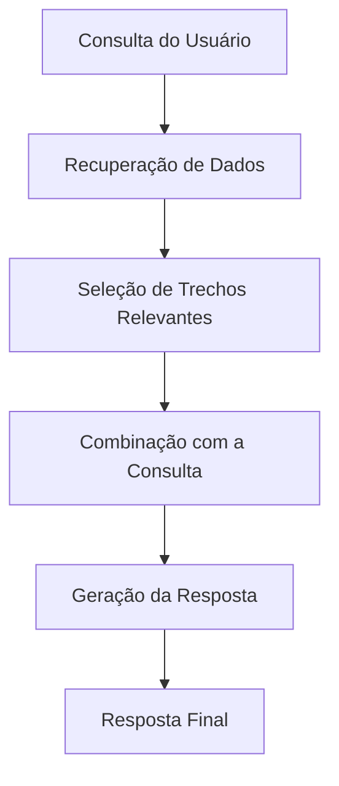

```markdown
# Retrieval Augmented Generation (RAG)

## Visão Geral

**Retrieval Augmented Generation (RAG)** é uma técnica avançada de IA que combina **recuperação de informações** (Retrieval) com **geração de linguagem natural** (Generation) para produzir respostas mais precisas e contextualizadas. Diferente dos modelos de linguagem tradicionais que dependem apenas de seu treinamento prévio, o RAG busca dados externos em tempo real para enriquecer suas respostas.

## Arquitetura Básica

A arquitetura do RAG é composta por dois componentes principais:

1. **Módulo de Recuperação (Retriever)**
   - Responsável por buscar informações relevantes em uma base de dados externa (ex: documentos, artigos, bancos de dados).
   - Utiliza técnicas como **embeddings** e **similaridade de cosseno** para encontrar trechos mais relevantes à consulta.
   - Exemplo de bibliotecas: `FAISS`, `Chroma`, `Pinecone`, ou `Weaviate`.

2. **Módulo de Geração (Generator)**
   - Recebe a consulta original + os trechos recuperados e gera uma resposta coerente.
   - Pode ser um modelo de linguagem como `LLama`, `Mistral`, `GPT-3.5`, ou outros.
   - Frameworks como `LangChain` ou `LlamaIndex` facilitam a integração desses componentes.

---

## Fluxo de Trabalho do RAG



1. **Entrada do Usuário**: A pergunta ou comando é recebido.
2. **Recuperação**: O sistema busca dados relevantes em uma base externa.
3. **Seleção**: Os trechos mais similares são filtrados (ex: usando `top_k` ou limiar de similaridade).
4. **Combinação**: Os trechos são formatados como contexto para o modelo de geração.
5. **Geração**: O modelo produz a resposta final, considerando tanto a consulta quanto os dados recuperados.
6. **Saída**: A resposta é retornada ao usuário.

---

## Vantagens do RAG

| Benefício | Descrição |
|-----------|-----------|
| **Precisão** | Respostas baseadas em dados atualizados e específicos. |
| **Transparência** | Permite citar fontes (ex: "Segundo o documento X..."). |
| **Redução de Alucinações** | Menos dependência de conhecimento interno do modelo. |
| **Adaptabilidade** | Funciona bem em domínios especializados (ex: medicina, direito). |
| **Atualização Contínua** | Base de dados pode ser atualizada sem retreinar o modelo. |

---

## Casos de Uso

1. **Assistentes de Suporte Técnico**
   - Responde dúvidas usando manuais e FAQs internos.
2. **Pesquisa Científica**
   - Busca artigos relevantes para gerar resumos ou insights.
3. **Sistemas de Perguntas e Respostas (Q&A)**
   - Ex: Chatbots que respondem com base em documentos internos.
4. **Educação Personalizada**
   - Gera explicações adaptadas ao nível do aluno, usando materiais didáticos.
5. **Análise de Dados**
   - Interpreta relatórios ou tabelas para gerar insights.

---

## Implementação com LangChain (Exemplo Prático)

### Pré-requisitos
- Python 3.8+
- Bibliotecas: `langchain`, `pypdf`, `chromadb`, `sentence-transformers`
- Modelo de linguagem (ex: `HuggingFaceHub`, `OpenAI`, ou local como `Mistral-7B`)

### Passo a Passo

#### 1. Instalação
```bash
pip install langchain pypdf chromadb sentence-transformers
```

#### 2. Carregar e Processar Documentos
```python
from langchain.document_loaders import PyPDFLoader
from langchain.text_splitter import RecursiveCharacterTextSplitter

# Carregar PDF
loader = PyPDFLoader("documento.pdf")
pages = loader.load_and_split()

# Dividir em chunks
text_splitter = RecursiveCharacterTextSplitter(
    chunk_size=1000,
    chunk_overlap=200
)