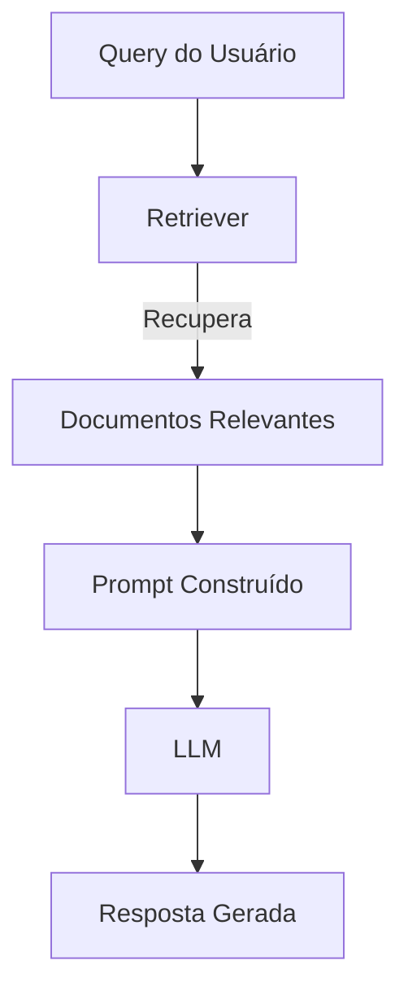

```markdown
# Resumo Mês 3: Entrando no Mundo RAG

## Visão Geral
Neste mês, focamos no conceito de **Retrieval-Augmented Generation (RAG)**, uma técnica que combina recuperação de informações com geração de linguagem para melhorar a precisão e relevância das respostas de modelos de linguagem.

---

## Conceitos Chave

### 1. O que é RAG?
- **RAG** é um framework que integra:
  - **Recuperação de Documentos**: Busca em fontes externas (bancos de dados, documentos, etc.) para obter informações relevantes.
  - **Geração de Texto**: Usa um modelo de linguagem (ex: LLM) para gerar respostas com base no contexto recuperado.
- **Objetivo**: Reduzir "alucinações" e melhorar a precisão, fornecendo contexto real ao modelo.

### 2. Componentes Principais
| Componente       | Função                                                                 |
|------------------|------------------------------------------------------------------------|
| **Retriever**    | Busca e recupera documentos ou trechos relevantes com base na query.  |
| **Prompt**       | Estrutura a entrada para o LLM, incluindo contexto recuperado.         |
| **LLM**          | Gera a resposta final com base no prompt enriquecido.                  |
| **Vector Store** | Armazena embeddings dos documentos para busca semântica eficiente.     |

### 3. Fluxo de Trabalho RAG


---

## Implementação com LangChain

### 1. Configuração Inicial
```python
from langchain_community.vectorstores import FAISS
from langchain_community.embeddings import HuggingFaceEmbeddings
from langchain.text_splitter import RecursiveCharacterTextSplitter
from langchain_core.documents import Document

# Carregar documentos (ex: PDF, TXT)
documents = [...]  # Lista de objetos Document

# Dividir documentos em chunks
text_splitter = RecursiveCharacterTextSplitter(chunk_size=1000, chunk_overlap=200)
docs = text_splitter.split_documents(documents)

# Criar embeddings e vector store
embeddings = HuggingFaceEmbeddings(model_name="sentence-transformers/all-mpnet-base-v2")
vector_store = FAISS.from_documents(docs, embeddings)
```

### 2. Pipeline RAG
```python
from langchain.chains import RetrievalQA
from langchain_community.llms import HuggingFaceHub

# Carregar LLM (ex: Hugging Face Hub)
llm = HuggingFaceHub(
    repo_id="google/flan-t5-large",
    model_kwargs={"temperature": 0.5, "max_length": 512}
)

# Criar cadeia RAG
qa_chain = RetrievalQA.from_chain_type(
    llm=llm,
    chain_type="stuff",
    retriever=vector_store.as_retriever(search_kwargs={"k": 3}),
    return_source_documents=True
)

# Executar query
query = "Qual o impacto da RAG em modelos de linguagem?"
result = qa_chain({"query": query})
print(result["result"])
print("Documentos fonte:", result["source_documents"])
```

### 3. Personalização
- **Retriever**:
  - Ajustar `search_kwargs={"k": N}` para controlar o número de documentos recuperados.
  - Usar `FAISS` ou `Chroma` como vector stores.
- **Prompt**:
  - Customizar templates para incluir instruções específicas ao LLM.
  - Exemplo:
    ```python
    from langchain.prompts import PromptTemplate

    template = """Use as seguintes peças de contexto para responder à pergunta no final.
    Se você não sabe a resposta, apenas diga que não sabe, não tente inventar uma resposta.

    Contexto: {context}

    Pergunta: {question}
    Resposta:"""
    prompt = PromptTemplate.from_template(template)
    ```

---

## Desafios e Soluções

| Desafio                          | Solução                                                                 |
|----------------------------------|-------------------------------------------------------------------------|
| **Ruído nos documentos**         | Filtrar documentos irrelevantes ou aplicar pré-processamento.           |
| **Latência na recuperação**       | Otimizar embeddings (ex: `all-MiniLM-L6-v2`) ou